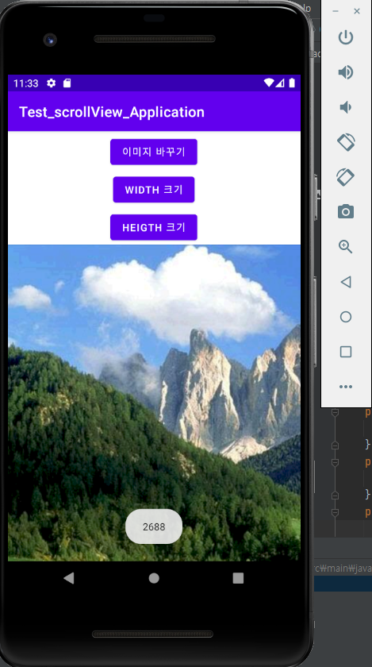
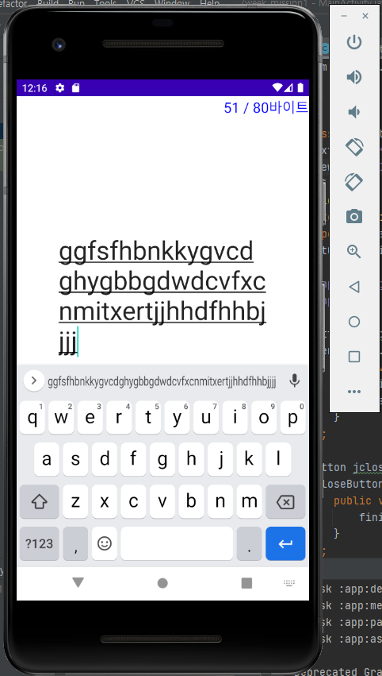

# 캡스톤 디자인 안드로이드앱프로그래밍

## 1주차
  - 안드로이드 앱 설명

## 2주차
  - Github 사용법

</img>

  - 2주차 과제

</img>

## 3주차
  - 3주차 과제
  
</img>
</img>

## 4주차
  - 4주차 과제
 
 </img>
 
 매번 다이어트를 작심삼일로 실패하는 여러분들, 친구와 함께 운동한다면 어떨까요?   
 그 날 그 날의 운동량, 식단, 체중 등 다양한 신체 변화를 공유하고   
 서로에게 응원과 피드백을 함께 한다면 더욱 의지가 강해지지 않을까요?
 
 ## 5주차
  - 5주차 과제

수업 끝나기 전에 문자로 전송 완료. (버튼 눌러서 이미지 바꾸기 - 영상)

## 6주차
  - 6주차 과제

</img>

## 7주차
  - 7주차 과제
</img>
